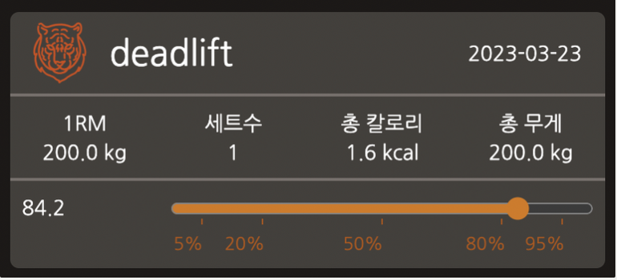
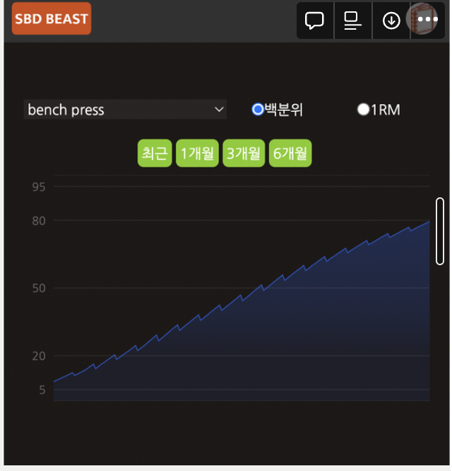
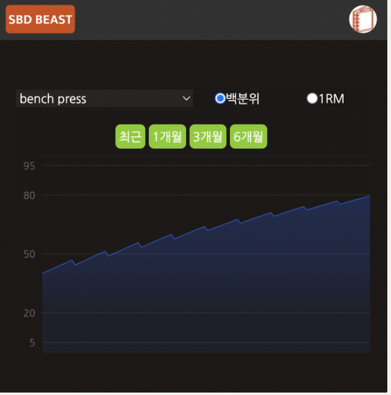
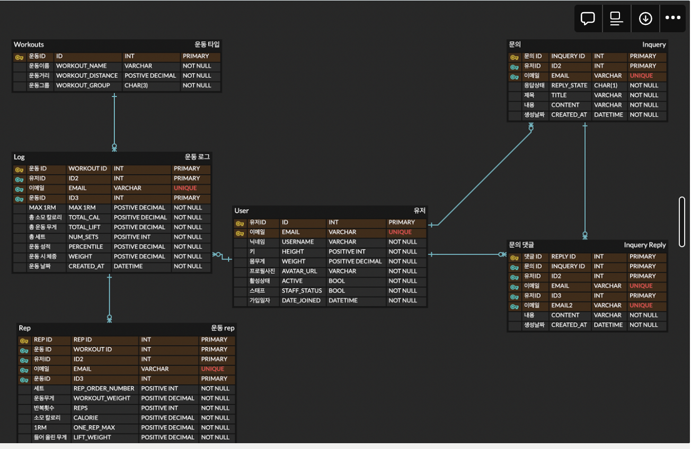

[프로젝트 설명 노션 링크](https://supreme-marimba-1b5.notion.site/SBD-ANIMAL-d8982e6459f846fc9420ed03b3e61847)
# 디렉터리 구조 /
```
├── backup_data # 개발환경 DB를 production 서버에 올리기 위한 백업 폴더입니다.
├── dev_db      # 개발환경 DB(docker 바인딩 volume을 위한 폴더)
│   ├── mysql
│   └── redis
├── prod_docker_compose # 로컬 및 서버에서 구동할 docker compose 
│   ├── prod
│   └── test
└── sbd_animal  # 프로젝트 root
    ├── config 
    ├── dist # admin Page (react build)
    ├── docs # 개발중 해결한 에러, 배운점 기록
    ├── media
    ├── sbd_admin_react # admin Page template(with react)
    ├── sbd_animal # API (with DRF)
    ├── settings # 개발,배포 세팅
    └── static
```

# 디렉터리 구조 /sbd_animal
```
├── __init__.py
├── __pycache__
├── accounts # API server : 유저 관리 (회원가입, 로그인)
├── beastTamers # back office API
├── bulletinBoard # API server : 문의 게시판
├── celery.py  # 이메일 레디스 비동기큐로 보내기 위한 celery
├── new_storage.py
├── storages.py # 배포 S3 storage 설정
├── urls.py
└── work_out # API server : 운동 타입, 로그 관리
```

## 핵심기능

1. 운동 로그 기능 + 1RM 기반 성적 + 해당 운동 소모 칼로리 기능

2. 기간별 운동 성적 변화(1,3,6달 기준)


3. 키, 몸무게 별 운동에 대한 성적(백분율), 칼로리 계산기


## 구현시 어려웠던 점
### 운동 예측 모델 
1. 운동 무게에 대한 성적을 <a href="https://strengthlevel.com/">https://strengthlevel.com/ </a>
의 사이트를 이용하여 제공 받으려고 하였으나 응답 속도가 너무 늦어
해당 사이트로부터 데이터를 확보해 예측모델(tensorflow로 구현)로 서빙하도록함
2. 학습 데이터 수집시 파이썬의 multiprocessing 모듈로 시간을 1/4단축
<a href="https://colab.research.google.com/drive/1InBc1qFpPTscI6eqJRmW5LqXQePLofbI?usp=sharing"> 코랩 크롤링 소스 링크</a>
3. 적은 데이터 확보후 선형보간법(scipy 라이브러리 interpolate2D함수 이용) 
4. 예측 서빙 서버를 따로 두지 않고 tensorflowjs로 클라이언트 단에서 서빙

### 유저 관리
1. 로그인(유저 인증 방식):
    로그인 지속을 위해 Authorization 리퀘스트 헤더필드 포함하지 않고 JWT를 쿠키에 담아 구현
2. 회원가입:
    가입시 이메일로 확인 코드를 보낼때 장고 내에서 처리하면 처리시간이 길어져
    celery + redis(작업 큐로 사용)로 장고 외부에서 처리하였습니다.
    이때 기본적으로 deactivate 상태로 계정이 생성되게 하지 않고 이메일로 보낸 코드와
    일치할때 생성하도록 하였습니다(클라이언트에서 유저 가입정보 저장하고 있다가 확인코드 일치시 회원가입 리퀘스트 보냄).
3. 어드민 로그인:
    따로 admin용 클라이언트를 구현하지 않고 react어플리케이션을 
    django template으로 사용

### Query
1. django signal: 유저 프로필이미지 업데이트시 기존의 사진 제거하기 위하여 
django signal의 pre_save method이용
2. Query Caching: 한번 조회한 데이터 같은 view 함수 블록에서 중복 조회 하지 않도록
querySet -> list(querySet)으로 캐싱
3. join 조회시 N+1 문제: 
정참조: queryset.select_related()
역참조: queryset.prefetch_related()
4. 조회시 가상 컬럼 생성:
queryset.annotate()로 조회 조건 설정

### Admin
django custom TemplateTag로  개발환경, 배포환경에 따른 템플릿 구현

### ERD



